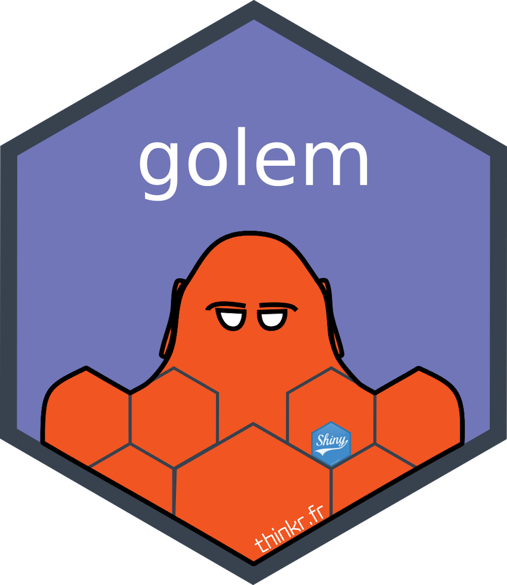
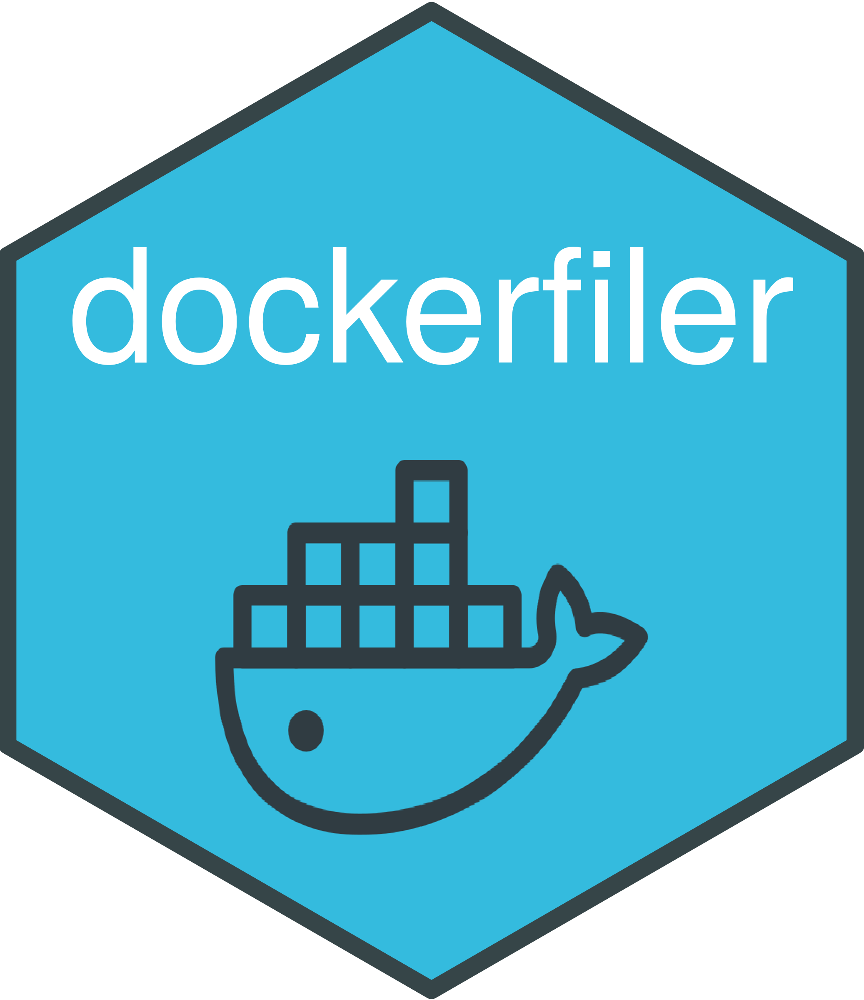
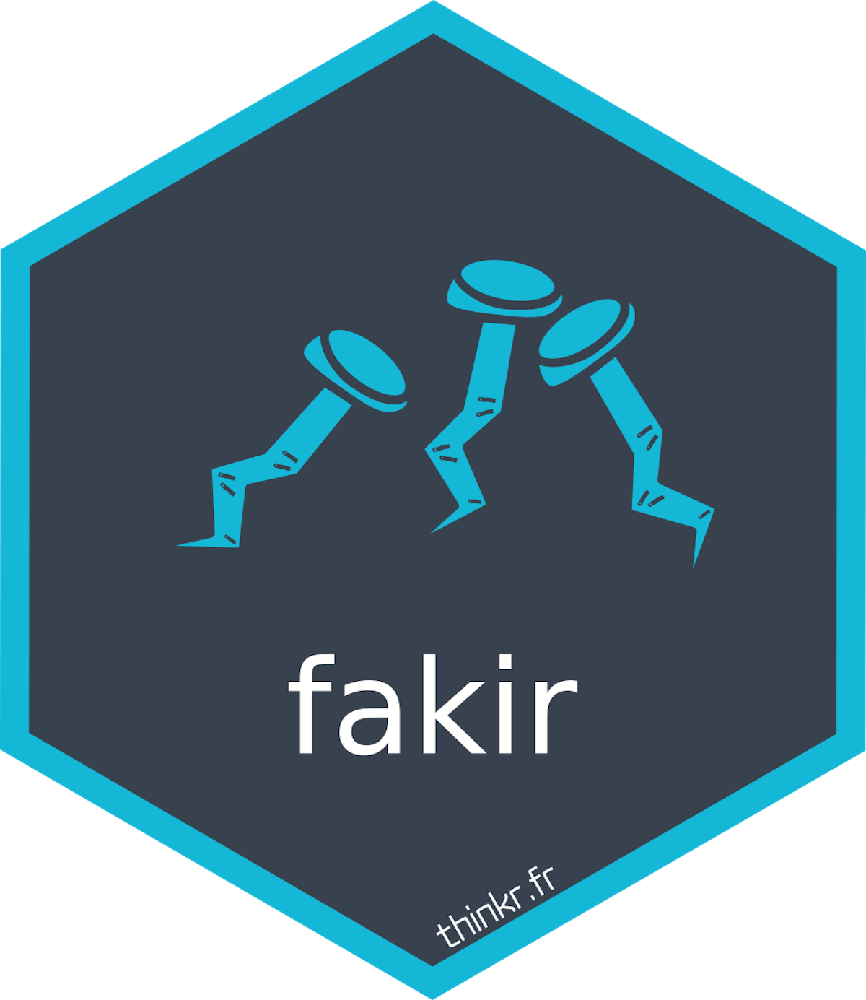
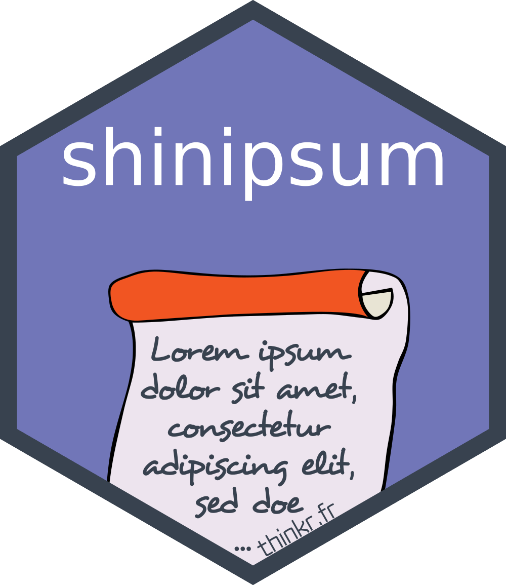
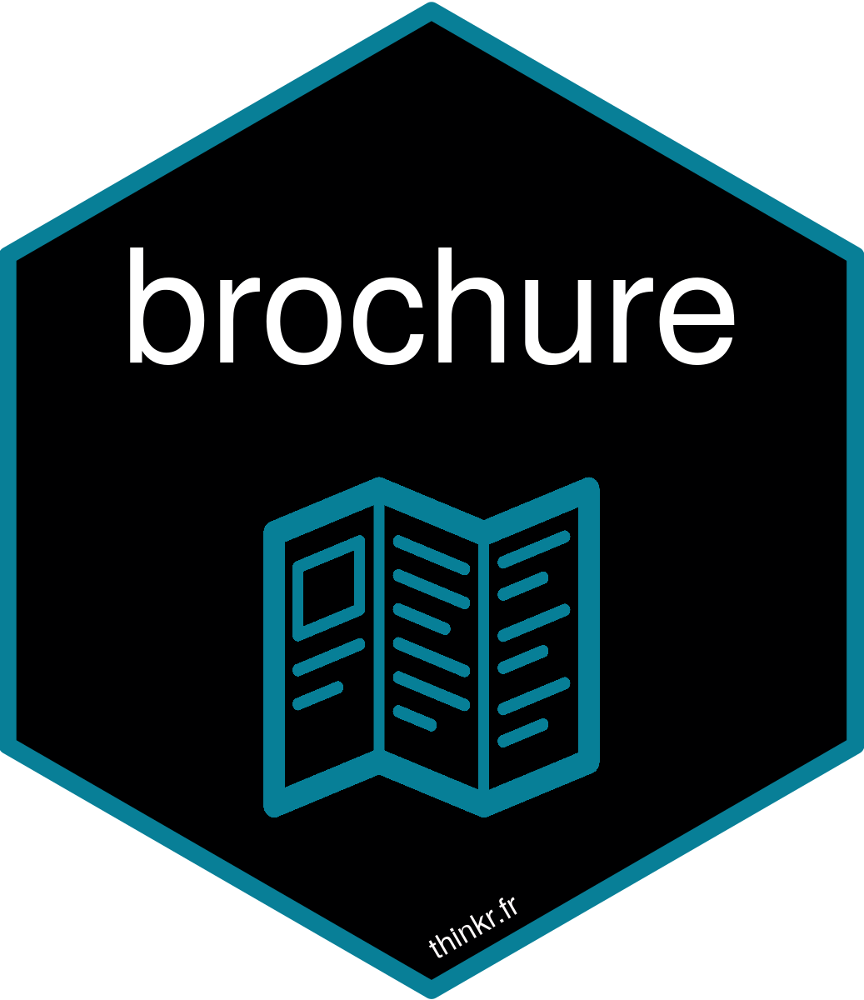
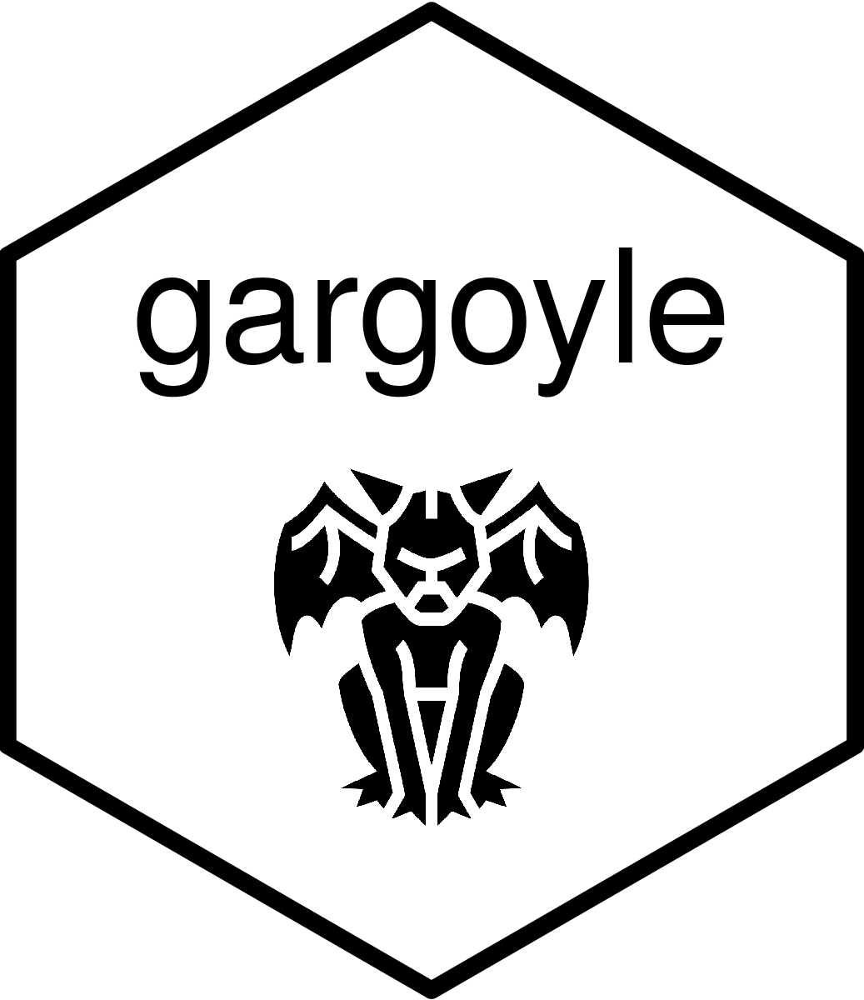
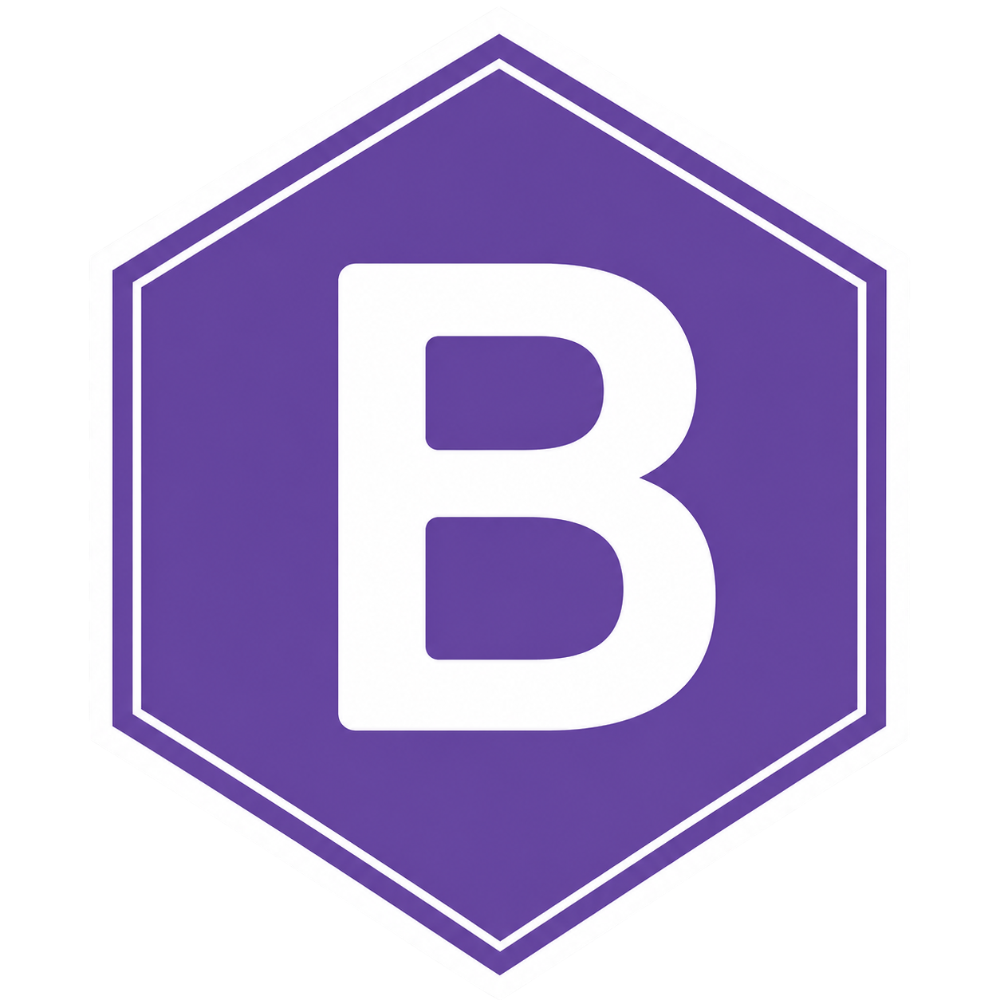
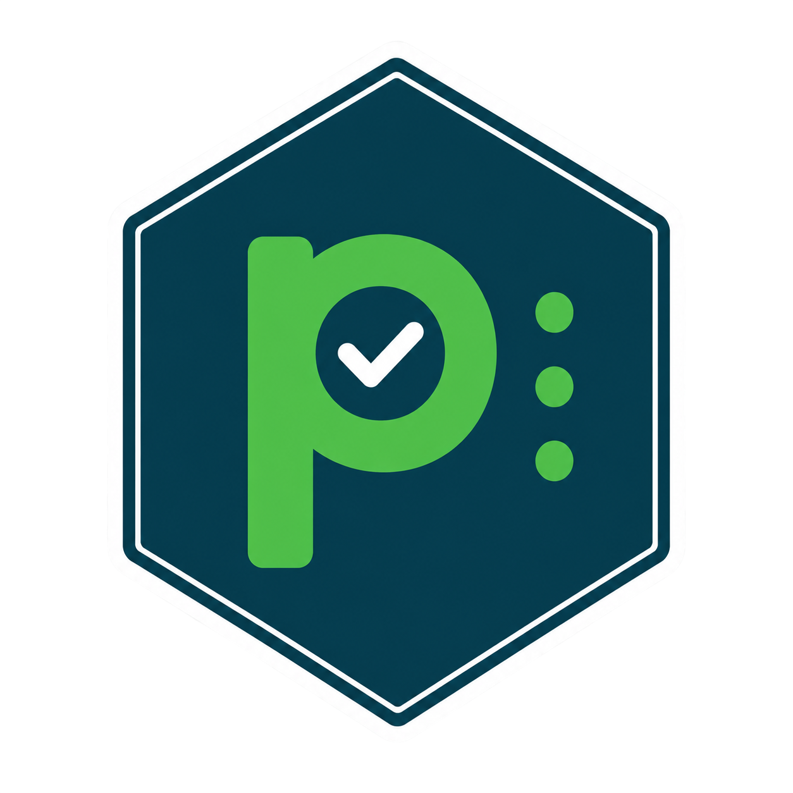
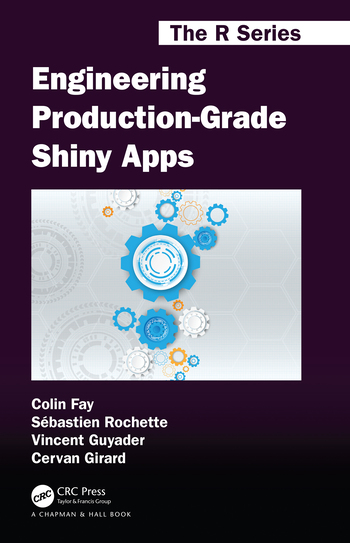

::: {.gv-hero}
::: {.gv-hero-copy}
<a class="gv-eyebrow" href="news/golem-1.0.0-release-on-cran/"><span class="gv-pill">New</span>{golem} 1.0 is out: agent skills, Docker + renv, cli output</a>

<h1>Shiny apps, engineered for production.</h1>

[The golemverse is a family of R packages for building, testing and shipping robust `{shiny}` applications, from the first prototype to the Dockerfile.]{.gv-lede}

<div class="gv-actions"><a class="gv-btn gv-btn-primary" href="packages/golem/">Get started with {golem}</a><a class="gv-btn" href="https://engineering-shiny.org/">Read the book</a></div>

```r
# From CRAN
install.packages("golem")
golem::create_golem("myapp", with_agents = TRUE)
```
:::

<div class="gv-hive">
<div class="gv-hive-grid" aria-hidden="true"></div>

<div class="gv-hive-chips" aria-label="Some golemverse packages">
<div class="gv-hive-chip-row">
<a class="gv-hive-chip" href="packages/dockerfiler/" aria-label="dockerfiler"></a>
<a class="gv-hive-chip" href="packages/fakir/" aria-label="fakir"></a>
<a class="gv-hive-chip" href="packages/shinipsum/" aria-label="shinipsum"></a>
<a class="gv-hive-chip" href="packages/brochure/" aria-label="brochure"></a>
<a class="gv-hive-chip" href="packages/gargoyle/" aria-label="gargoyle"></a>
<a class="gv-hive-chip" href="packages/bootstrict/" aria-label="bootstrict"></a>
<a class="gv-hive-chip" href="packages/pw/" aria-label="pw"></a>
</div>
<span class="gv-hive-more">+ 16 more</span>
</div>
</div>
:::

<div class="gv-stats" data-gv-cran="golem" data-gv-repo="ThinkR-open/golem">
<div class="gv-stat"><span class="gv-stat-value" data-gv="downloads">—</span><span class="gv-stat-label">downloads of {golem} last month</span></div>
<div class="gv-stat"><span class="gv-stat-value" data-gv="stars">—</span><span class="gv-stat-label">stars on GitHub</span></div>
<div class="gv-stat"><span class="gv-stat-value" data-gv="version">—</span><span class="gv-stat-label">current CRAN release</span></div>
</div>

<div class="gv-section-head"><div><h2>Core packages</h2><p>The maintained heart of the golemverse. Start with {golem}, add the others as your app grows.</p></div><a href="packages/">All packages →</a></div>

::: {#core-packages}
:::

<div class="gv-section-head"><div><h2>One family, a clear lifecycle</h2><p>Every package is tagged so you know what you can rely on.</p></div></div>

<div class="gv-tiers">
<div class="gv-tier"><div><span class="gv-pill gv-pill-core">Core</span></div><p>Maintained by ThinkR. Safe to build on, with CRAN releases when the API is stable.</p></div>
<div class="gv-tier"><div><span class="gv-pill gv-pill-experimental">Experimental</span></div><p>Young or moving fast. Try them, expect rough edges, and tell us what breaks.</p></div>
<div class="gv-tier"><div><span class="gv-pill gv-pill-abandoned">Abandoned</span></div><p>No longer maintained. Kept online for reference, not for new projects.</p></div>
</div>

<div class="gv-book">

<div>
<span class="gv-kicker">The book</span>
<h2>Engineering Production-Grade Shiny Apps</h2>
<p>The method behind the golemverse: design, build, test, deploy. Free to read online, and in print in the R Series by Chapman and Hall/CRC.</p>
<div class="gv-actions"><a class="gv-btn gv-btn-primary" href="https://engineering-shiny.org/">Read it online, free</a><a class="gv-btn" href="https://www.routledge.com/Engineering-Production-Grade-Shiny-Apps/Fay-Rochette-Guyader-Girard/p/book/9780367466022?utm_source=author&utm_medium=shared_link&utm_campaign=B043139_jm1_5ll_6rm_t081_1al_engineeringproduction-gradeshinyappsauthorshare">Get the print edition</a></div>
</div>
</div>

<div class="gv-section-head"><div><h2>From the blog</h2></div><a href="news/">All posts →</a></div>

::: {#blog-listings}
:::

## Contact

Contact us via the [ThinkR website](https://rtask.thinkr.fr/contact/).
