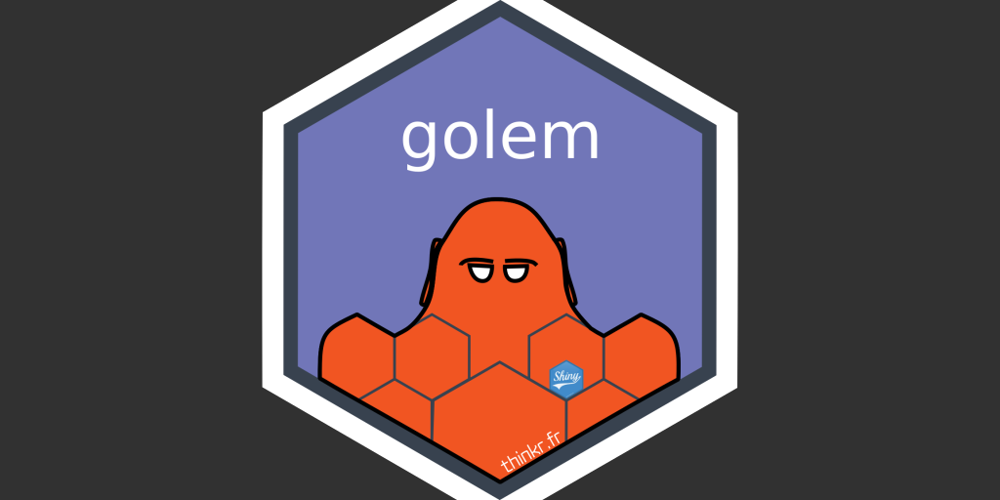

We're thrilled to announce that after years of powering Shiny applications in production, `{golem}` has finally reached a symbolic milestone: version **1.0.0**. This is more than a version bump. This release brings a brand-new tooling story for coding agents, a fully reworked Docker/`{renv}` deployment workflow, modernized console output powered by `{cli}` — all of it alongside a set of **breaking changes** you should read before upgrading an existing project.

> **Side note — install 1.0.1, not 1.0.0.** Shortly after the 1.0.0 release, we caught a bug in the `favicon()` function that made it fail when `{fs}` wasn't installed. This is fixed in **1.0.1** (the href is now built with base R, so the deployed app carries no `{fs}` dependency). Just run `install.packages("golem")` to get it.

Here's a quick tour.

## Why 1.0.0?

`{golem}` is an opinionated framework for building production-grade Shiny applications, as R packages. Since its very first release, the goal hasn't changed: give your applications a robust, testable, deployable structure. Moving to 1.0.0 acknowledges that the API is mature and stable — and it's also the right moment to clean up a few legacy behaviors that deserved to be clarified.

## The headline feature: agent skills

This is _the_ flagship addition in this version. `{golem}` now ships tooling to install **agent skills** (in the Claude Code / `AGENTS.md` layout) directly into your project.

Concretely, a new family of functions makes its appearance:

```r
# Install skills into an existing golem project
golem::use_skills()
golem::use_agent_skills()
golem::use_claude_skills()
golem::use_skill()
```

These helpers install skills — either the ones bundled inside the package, or those from the upstream [`ThinkR-open/golem-agent-skills`](https://github.com/ThinkR-open/golem-agent-skills) repository. The idea: give your coding assistant native knowledge of golem conventions (adding a module, a function, running a check, fixing missing `ns()` calls…).

And to start on the right foot, `create_golem()` gains two arguments, `with_agents` and `with_agents_options`, to install these skills right at project creation. The RStudio "New Project" wizard exposes a matching set of options too.

A detail that matters for `R CMD check` purists: installing skills automatically appends the corresponding entries (`^\.claude$`, `^CLAUDE\.md$`, `^\.agents$`, `^AGENTS\.md$`) to `.Rbuildignore`, so the check doesn't flag them as non-standard top-level files.

## A reworked Docker/`{renv}` deployment story

Dockerfile generation has been seriously modernized. The `add_dockerfile_with_renv*()` functions now produce:

- a **multi-stage Dockerfile by default** (pass `single_file = FALSE` to keep the previous two-file behavior);
- a Dockerfile that sets `golem.app.prod = TRUE` by default (disable it with `set_golem.app.prod = FALSE`).

In parallel, two new helpers generate minimal deployment CI for freshly created apps:

```r
golem::add_github_action()
golem::add_gitlab_ci()
```

These CI helpers restore `renv.lock` when it's present, fall back to `DESCRIPTION` when it isn't, and declare `{pkgload}` for the generated Posit Connect entrypoint.

The logical consequence: the older `add_dockerfile()`, `add_dockerfile_shinyproxy()` and `add_dockerfile_heroku()` functions are now explicitly **soft-deprecated**. Use their `add_dockerfile_with_renv_*()` counterparts.

## Console output powered by `{cli}`

Every function that prints to the console has been reworked and standardized using the `{cli}` package. Messages, progress bars, unzip feedback… the whole thing is more consistent and easier on the eyes. Worth noting along the way: `run_dev()` now prints a single message.

## JavaScript bindings rework

If you've ever used `add_js_input_binding()` or `add_js_output_binding()`, you know the skeleton needed quite a bit of manual completion. Not anymore: these functions now generate a **functional binding out of the box**.

The JS file contains working implementations of `find`, `getValue`/`renderValue`, `setValue`, `receiveMessage` and `subscribe`. An R companion file (`fct_<name>_input_binding.R` / `fct_<name>_output_binding.R`) is created alongside it, with a ready-to-use UI constructor, update, and render functions.

Two things to be aware of (these are breaking changes, see below): the file naming scheme changes (`<name>-input.js`), and the default `events` argument was adjusted to produce a binding that works right away.

## Other useful additions

- `add_fct()` gains a `template` argument to customize the content of the generated file; the default template is now exposed via the `fct_template()` function, mirroring the `module_template()` / `add_module()` pattern.
- The `use_external_*()` family and `use_bundled_html()` gain a `replace` argument: with `TRUE`, an existing file (or bundle directory) is overwritten instead of aborting.
- `use_bundled_html()` downloads HTML templates as zip archives, can extract them into `inst/app/www`, and remove the raw zip afterwards.
- Scaffolding helpers (`use_*`, `add_*`, `set_golem_*`) now emit a warning when called while `{golem}` is in production mode (`options('golem.app.prod' = TRUE)`) — handy for catching an accidental call from a deployed app.

## ⚠️ Breaking changes to read before upgrading

This is a major release, and it intentionally breaks a few behaviors. The main ones:

- **Unified path arguments.** The `wd`, `path` and `pkg` arguments are standardized into a single `golem_wd`. The legacy names remain as deprecated aliases (with a warning), **but any value passed to an alias is silently ignored**: the function reads `golem_wd` instead. If you relied on a non-default path, switch to `golem_wd`.
- **`get_current_config()` reworked.** It now reads either the `GOLEM_CONFIG_PATH` environment variable or the default path (`inst/golem-config.yml`) — no more guessing exotic paths — and hard-fails if the file doesn't exist. It no longer copies missing config files from the skeleton.
- **Removed functions.** `get_sysreqs()` (use `dockerfiler::get_sysreqs()`), `use_recommended_deps()`, and `add_rstudioconnect_file()` (use `add_positconnect_file()`).
- **Stricter `add_*`/`use_*`.** These functions now fail if the target directory doesn't exist (creating the directory isn't their job) or if the file already exists.
- **`create_golem(overwrite = TRUE)`** now deletes the old folder and replaces it with the golem skeleton.
- **Lighter creation.** Creating a golem no longer calls `set_here()` nor `usethis::create_project()`. The package finds its way via `DESCRIPTION`, which avoids interfering with how `here()` resolves.
- **JS bindings**: new naming scheme (`<name>-input.js` / `<name>-output.js` instead of `input-<name>.js`), and a new default `events`. Remember to rename or delete your old binding files.

## Under the hood

A few internal changes that pay off over time:

- The package now uses the [air](https://posit-dev.github.io/air/) formatter (with a pre-commit hook), replacing grkstyle.
- Full refactoring of the `add_*_files` and `use_*_files` functions, which now all share the same behavior.
- `{golem}` now ships a `CLAUDE.md` file and a series of skills.

## How to upgrade?

```r
install.packages("golem")
```

For an existing project, read the breaking changes section above (and the `NEWS.md`) first, then update your code. If you're starting a new app, consider enabling agent skills right from creation:

```r
golem::create_golem("myapp", with_agents = TRUE)
```

## Thanks

This release is the result of many contributors' work — a special thank you to **Ilya Zarubin (@ilyaZar)** for his massive involvement, and to everyone who opened issues, submitted PRs, and tested the development versions.

Happy coding 🚀

---

_Report any issue on the [issue tracker](https://github.com/ThinkR-open/golem/issues). Full documentation is available at [thinkr-open.github.io/golem](https://thinkr-open.github.io/golem/)._
